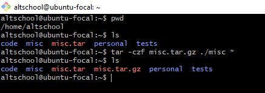

`login name is -> altschool, home directory is -> /home/altschool. The home directory contains the following sub-directories: code, tests, personal, misc.`

`a. Change directory to the tests directory using absolute pathname`

`b. Change directory to the tests directory using relative pathname`

`c. Use echo command to create a file named fileA with text content ‘Hello A’ in the misc directory`

`d. Create an empty file named fileB in the misc directory. Populate the file with a dummy content afterwards`

`e. Copy contents of fileA into fileC`

`f. Move contents of fileB into fileD`

`g. Create a tar archive called misc.tar for the contents of misc directory`

`h. Compress the tar archive to create a misc.tar.gz file`

`i. Create a user and force the user to change his/her password upon login`

`j. Lock a users password`

`k. Create a user with no login shell`

`l. Disable password based authentication for ssh`

